# Aufgabe C - Semesterprojekt
Das abschließende Semesterprojekt habe ich eigens als nodejs-Anwendung programmiert. Zur Entwicklung habe ich **Visual Studio Code** verwendet.

In der Aufgabenstellung wird zusätzlich gefordert, auch einen CLI-basierten Codeagent zu installieren. Das hat am Ende leider nicht so gut funktioniert und ich habe mich dazu entschieden, keinen weiteren Fokus auf diesen Teil der Aufgabenstellung zu legen.

[Claude Code Installationsversuch](./claude-cli.md)

## Grundidee
Jeder Partygast kann über sein Handy am Assassin-Spiel teilnehmen. Jeder Teilnehmer bekommt eine Person und ein Wort zugewiesen. Ziel ist es, die zugewiesene Person in einer natürlichen Konversation das Wort sagen zu lassen. So kommen die Partygäste durch die Teilnahme am Spiel ins Gespräch. Die Spieler-Verknüpfungen sind ein zyklischer Graph, der sich mit Voranschreiten des Abends zuschnürt. Das Spiel ist vorbei, wenn der GameMaster es beendet oder tatsächlich nur noch ein Assassin übrig bleibt, der Graph also nur noch einen Knoten hat.

Ich habe versucht, das Projekt soweit herunterzubrechen, dass ich es möglichst simple umsetzen kann. Ich bin mit folgenden Punkten verblieben:

### Technologie
- NodeJS-Webanwendung
- Für Echtzeit-Updates Client-/Server-Kommunikation über Websockets
- nginx-Reverseproxy für HTTPS
- GameState über JSON-Dateien
- Frontend mit Bootstrap
- GameMaster-View Graph-Visualisierung mit Hilfe der [GoJS-Library](https://gojs.net/)

### Lobbyidentitäten
- Spieler kommen über die Hauptseite in die Lobby (erhalten Code z.B. `ABCD`)
- GameMaster weist eine Lobbysession manuell einer Spieleridentität zu
  - Spieler hätten sich auch selbstständig über Namen registrieren können, aber dann wäre Manipulation möglich und das sollte verhindert werden

### GameMaster
- Der GameMaster steuert über eine spezielle URL das Spiel
- GameMaster fügt im Vorfeld aller Spielernamen und Wortliste ein
- GameMaster kann Spieleridentitäten während des Spiels dynamisch verwalten
  - Hinzufügen
  - Löschen
  - Namen ändern
  - Wort ändern erhalten haben
- Der GameMaster kann die Spielhistorie jederzeit einsehen, der alle Aktionen protokollieren soll

### Spieler
- Spieler sehen folgende Informationen, nachdem sie ihre Spieleridentität
  - Zielperson
  - Zielwort (kann 1x pro Spiel neu gezogen werden)
  - Regelwerk
  - Ihren Secret Badgecode
- Bei einem Kill gibt das Opfer freiwillig den Secret Badecode an den Assassin weiter
- Der Assassin gibt den Badecode des Opfers ein um den Kill zu registrieren

## Dokumentation Codestruktur
Die Struktur der Codebasis habe ich wiefolgt konzipiert:
| Codedatei | Bescreibung |
| ------------- | ------------- |
| communication/comm_gamemaster.js | Websocketkommunikation GameMaster  |
| communication/comm_players.js  | Websocketkommunikation Spieler |
| managers/GameManager.js  | Alle Funktionen, die sich auf das Spielgeschehen beziehen (z.B. Killregistrierung, Spielerassoziation, Badgecodegenerierung, etc.) |
| managers/GameStateManager.js  | Interaktion mit den JSON-Dateien für den Spielstand |
| managers/LobbyManager.js  | Verwaltung der Lobby-Sessions |
| views/...  | ejs-Templates für GameMaster-View und Spieler-View |
| public/...  | Alle Ressourcen, die GameMaster und Spieler in die HTML-Seite einbinden |

## Dokumentation Funktionen comm_gamemaster.js
| Funktion | Bescreibung |
| ------------- | ------------- |
| UpdateLobby | Wird aufgerufen, wenn sich der Lobbystatus ändert und broadcasted diesen an alle verbundenen GameMaster-Sessions  |
| UpdateModel | Wird aufgerufen, wenn sich der Spielstand ändert und broadcasted diesen an alle verbundenen GameMaster-Sessions  |
| BroadCast | Wird aufgerufen, wenn eine spezifische Nachricht an alle verbundenen GameMaster-Sessions gesendet werden soll (z.B. bei player_modify) |

## Dokumentation Funktionen comm_players.js
| Funktion | Bescreibung |
| ------------- | ------------- |
| UpdateGameState (lobby_code) | Schickt GameState-Update an eine spezifische Lobbysession |
| UpdateAllGameStates | Schickt GameState-Update an alle Spieler-Sessions |
| Reset | Trennt alle Spieler-Sessions und forciert somit Reconnect. Wird verwendet, wenn das Spiel zurückgesetzt wird  |

## Dokumentation Funktionen GameManager.js
| Funktion | Bescreibung |
| ------------- | ------------- |
| UpdateModel (history_message) | Speichert den Spielstand persistent ab und broadcastet ihn an alle GameMaster-Sessions -> Optional kann eine Nachricht für Spielprotokoll übergeben werden |
| ResetGame | Das Spiel wird komplett neu initialisiert |
| CreatePlayerNode (player_name) | Generiert ein Graph-Nodeobject für einen neuen Spieler |
| AddPlayer(data) | Erstellt einen neuen Spieler und fügt ihn entsprechend der Attribute der Variable `data` in den zyklischen Graphen ein |
| InitializeGame(player_names, words) | Erstellt aus Spielernamen und Worten einen neuen zyklischen Graphen mit zufälliger Reihenfolge und initialisiert damit ein neues Spiel |
| UpdateWordpool (words) | Aktualisiert den Wordpool -> GameMaster kann diesen während des Spiels anpassen |
| Associate (uuid, lobby_code) | Verbindet Lobbycode mit Spieleridentität anhand dessen uuid. Disassoziiert wenn notwendig eine schon verbundene Lobbysession (z.B. bei Browser-Cache-Reset) |
| Disassociate (lobby_code) | Entfernt Lobbycode von verbundener Spieleridentität, wenn vorhanden |
| EndGame | Beendet das Spiel (entweder automatisch bei letztem Kill oder manuell, wenn GameMaster dies ausführt) |
| ExecuteKill (lobby_code, target_uuid) | Registriert einen Kill und passt den zyklischen Graphen an. Das Spiel wird automatisch beendet, falls dieser Kill dazu führt, dass nur noch der Assassin übrig bleibt. |
| ModifyPlayer (uuid, new_name, new_word) | Ändert den Spielernamen und das Zielwort -> Funktion wird vom GameMaster verwendet |
| RedrawWord (lobby_code) | Weist der mit dem Lobbycode verbundenen Spieleridentität ein zufälliges neues Wort aus dem Wordpool zu und erhöht den Redraw-Count der Spieleridentität. |
| DeletePlayer (uuid, option) | Löscht einen Spieler aus dem zyklischen Graph. Wenn option == 1, dann wird das eingehende Wort behalten, wenn option == 2, dann wird das ausgehende Wort behalten. Wenn nach dem Löschen nur ein Spieler übrig bleibt, wird das Spiel automatisch beendet. |
| GetNodeFromCode (lobby_code), GetNodeFromUUID (uuid) | Funktionen zum Suchen von spezifischen Nodes |
| GetPlayerGameState (lobby_code) | Generiert den an den Spieler zu sendenden persönlichen GameState anhand des Lobbycodes. |
| SetPlayerOnline (lobby_code, online) | Ändert den Online-Indikator für eine Spieleridentität, sofern diese anhand des Lobbycodes gefunden werden konnte. |
| GetModel | Gibt den aktuellen Spielzustand vollständig zurück |

## Dokumentation Funktionen LobbyManager.js
| Funktion | Bescreibung |
| ------------- | ------------- |
| UpdateLobby | Speichert den Zustand der Lobby persistent und sendet ihn an alle verbundenen GameMaster-Sessions |
| Register | Generiert eine neue Lobbysession und gibt ihren Lobbycode zurück |
| IsRegistered (code) | Überprüft, ob ein gegebener Lobbycode als Lobbysession registriert ist |
| IsOnline (code) | Überprüft, ob eine Lobbysession gerade online ist |
| SetOnline (code, online) | Setzt den Online-Status einer Lobbysession |
| GetLobby | Gibt den gesamten Lobbyzustand zurück |
| ResetLobby | Setzt die Lobby vollständig zurück |
| RunCodeHouseKeeping | Läuft alle 30 Sekunden und löscht alle Offline-Lobbysessions, die älter als eine Stunde sind. |

## Dokumentation finale Anwendung (mit Screenshots & Videos)

Ich dokumentiere die App chronologisch angelehnt daran, wie man sie in der echten Vorbereitung und Durchführung einer Party auch wirklich erleben würde.

### GameMaster Spielinitialisierung
Der GameMaster kann auf `create new game` klicken und anschließend eine Liste an Spielernamen und Worten angeben. Mit einem Klick auf `create game` wird automatisch der zyklische Graph erstellt und sofort angezeigt.

Spielinitialisierung             |  Resultat
:-------------------------:|:-------------------------:
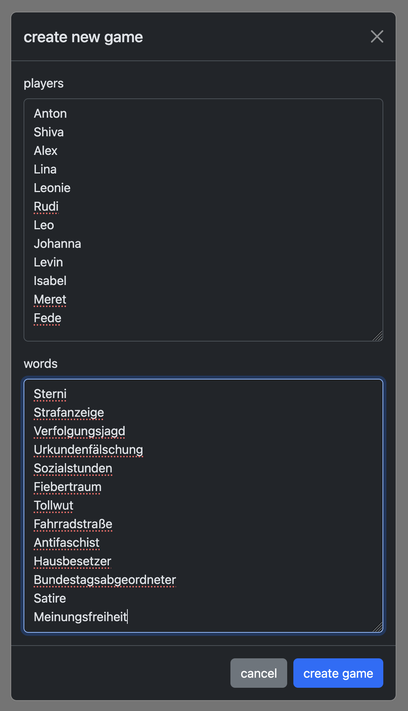  |  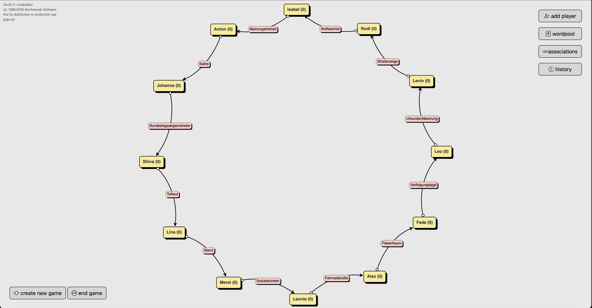

### GameMaster dynamische Bearbeitung
Jetzt merkt der GameMaster, dass `Rudi` eigentlich immer `Rudolph` genannt wird und außerdem weiß der gar nicht, was ein `Antifaschist` ist, deswegen soll er auch ein anderes Wort bekommen. Was ein `Nazi` ist, das weiß auch Rudolph. Mit einem Klick auf seinen Namen lässt sich alles ganz leicht anpassen.

Bearbeitung             |  Resultat
:-------------------------:|:-------------------------:
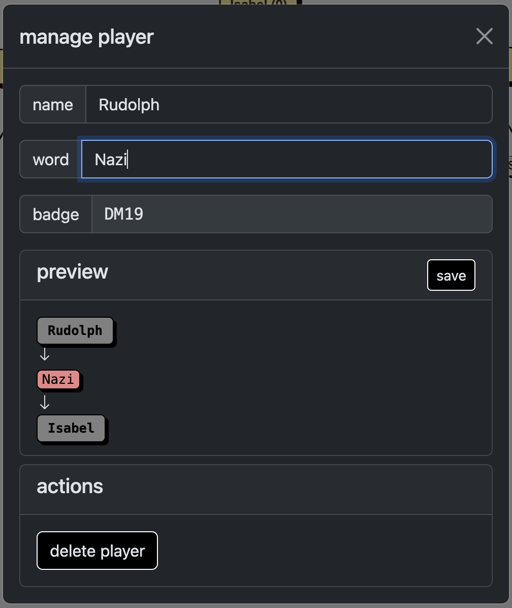  |  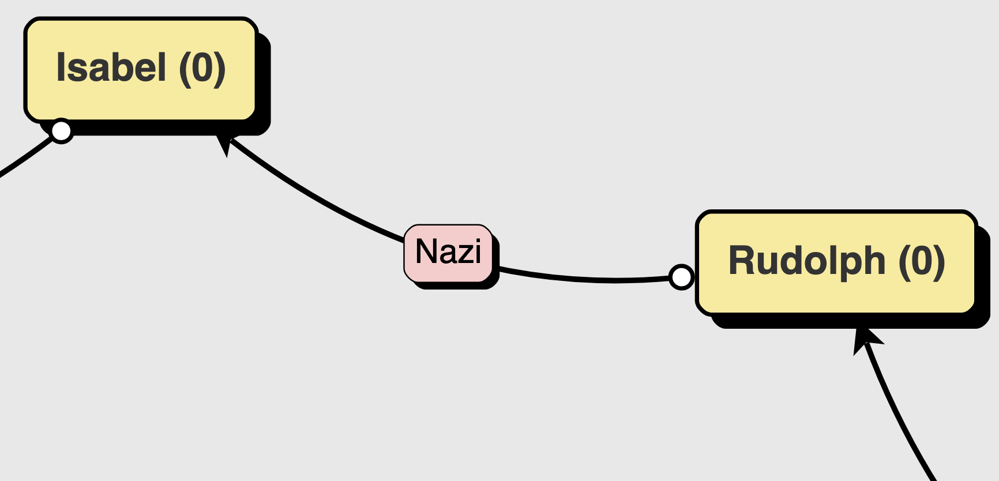

### Ein Spieler öffnet die Hauptseite
Johanna kommt als erstes an und sieht den QR-Code an der Eingangstür hängen. Sie scannt ihn mit ihrem Smartphone und landet sofort auf der Hauptseite des Spiels.

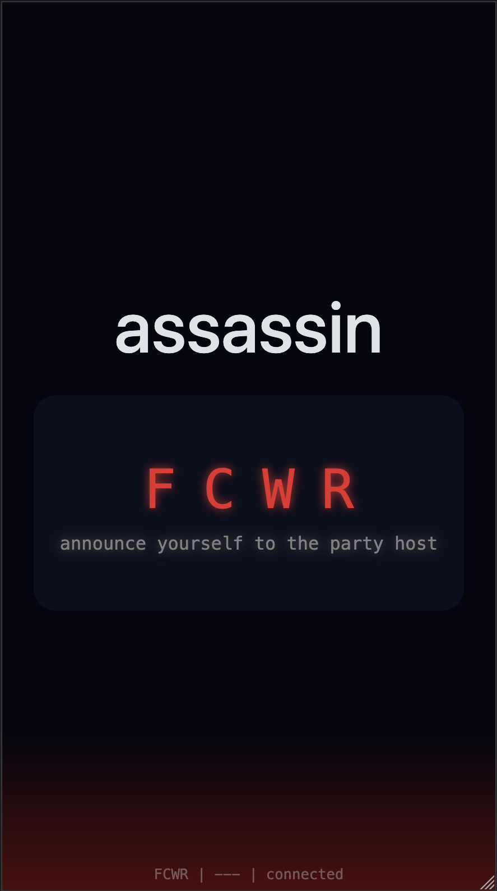

### GameMaster Lobbycode-Zuweisung
Aufgeregt läuft Johanna zu Anton, der heute die Party veranstaltet. Sie stellt sich vor und sagt, dass sie den Code `FCWR` zugewiesen bekommen habe.

Anton weist über den GameMaster-View Johanna ihrer Spieleridentität zu.

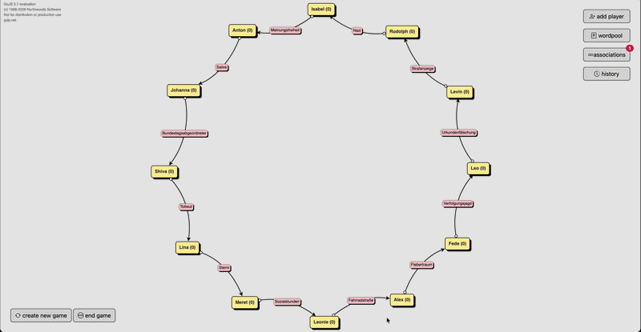

### Spieler erhält die Zielinformationen
Johanna  sieht nun die Zielansicht, in der sie durch Tippen auf das verdeckte Feld, ihre Zielperson und das Zielwort sehen kann. Über `how it works` kann sie sich die Spielregeln anzeigen lassen.

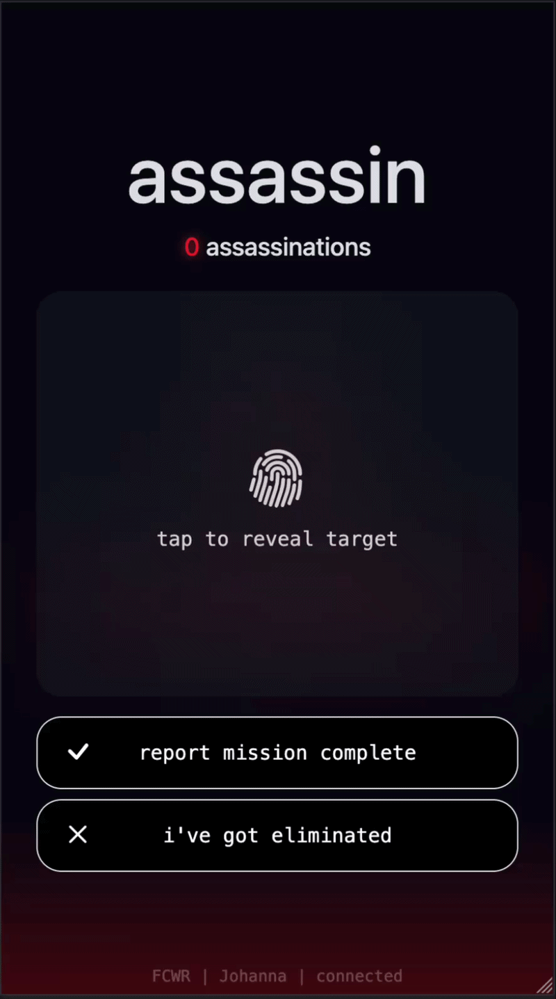

### GameMaster unerwarteter Partygast
Plötzlich klingelt es und als Anton die Tür öffnet, steht dort plötzlich Stefan. Eigentlich war der gar nicht eingeladen, aber natürlich kann er reinkommen und soll auch beim Spiel mitmachen können.

Über den GameMaster-View kann Anton unter `add player` problemlos einen neuen Spieler hinzufügen und ihn überall dort im zyklischen Graphen platzieren, wo der Vorgänger noch nicht online ist. Warum nur hinter Personen, die noch nicht online sind? Naja, weil sich sonst die Zielperson eines Partygasts ändern würde, der schon am Spiel teilnimmt.

Außerdem kann Anton auch noch entscheiden, ob das neue Wort vor oder hinter der neuen Person platziert wird.

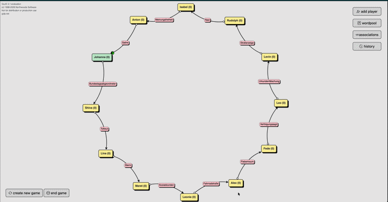

### GameMaster Gast hat abgesagt
Eine halbe Stunde später bekommt Anton einen Anruf.
> Man sorry Anton, ich bin immer noch im Studio, ich komm heute nicht mehr!

Alex muss also aus dem Graphen entfernt werden, weil Leonie sonst ihr Ziel nicht verfolgen kann. Zum Glück kein Problem!

Auch hier kann Anton auswählen, welches der beiden Zielwörter bestehen bleiben soll. Er entscheidet sich für `Fiebertraum`.

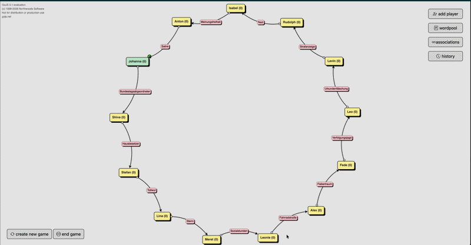

### Spieler registriert Kill
Johanna hat es geschafft. 
> Wie heißen nochmal die Politiker, die hier in Berlin in diesem Gebäude sitzen und unsere Interessen vertreten sollen?

Shiva der Idiot fällt sofort auf Johannas Frage herein und freut sich, dass er endlich mal wieder einer Frau erklären kann, wie die Dinge funktionieren.
> Das Gebäude von dem du sprichst heißt "Bundestag" und die Politiker, die unsere Interessen vertreten sollen werden "Bundestagsabgeordnete" genannt.

Es schient Shiva große Überwindung zu kosten, zu akzeptieren, dass er jetzt tatsächlich auf Johanna hereingefallen war. Aber schließlich erklärte er sich bereit, seinen Badgecode herauszurücken.

Johanna gibt den Code ein und erhält eine Killbestätigung. Sofort erbt sie Shivas Zielperson und sein Zielwort. Johanna muss sich als nächstes um Stefan kümmern. Ob Stefan wohl auch so leicht auszutricksen ist?

Shiva's Ansicht             |  Johannas Ansicht
:-------------------------:|:-------------------------:
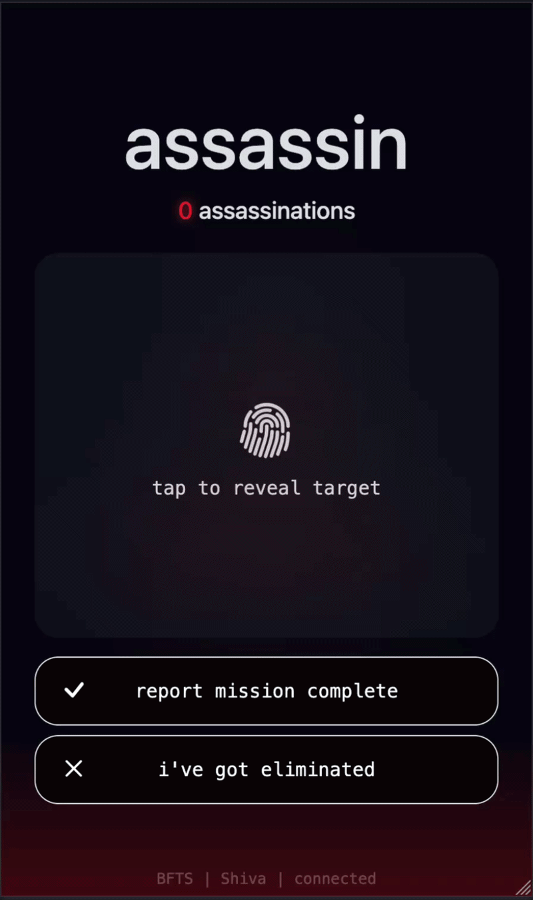  |  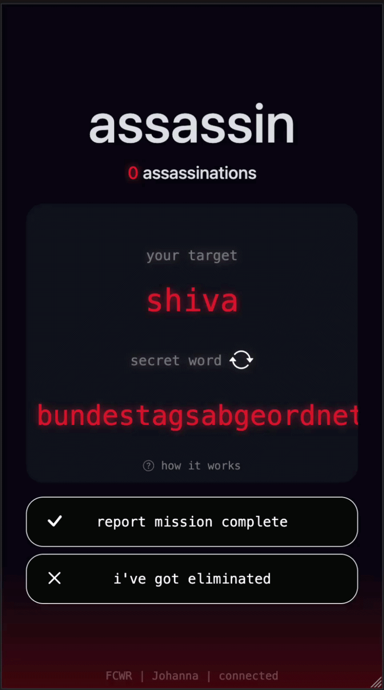

Shiva's Deathscreen             |  GameMaster-Ansicht
:-------------------------:|:-------------------------:
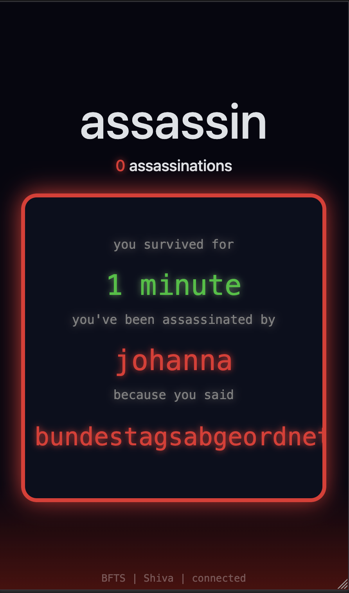  |  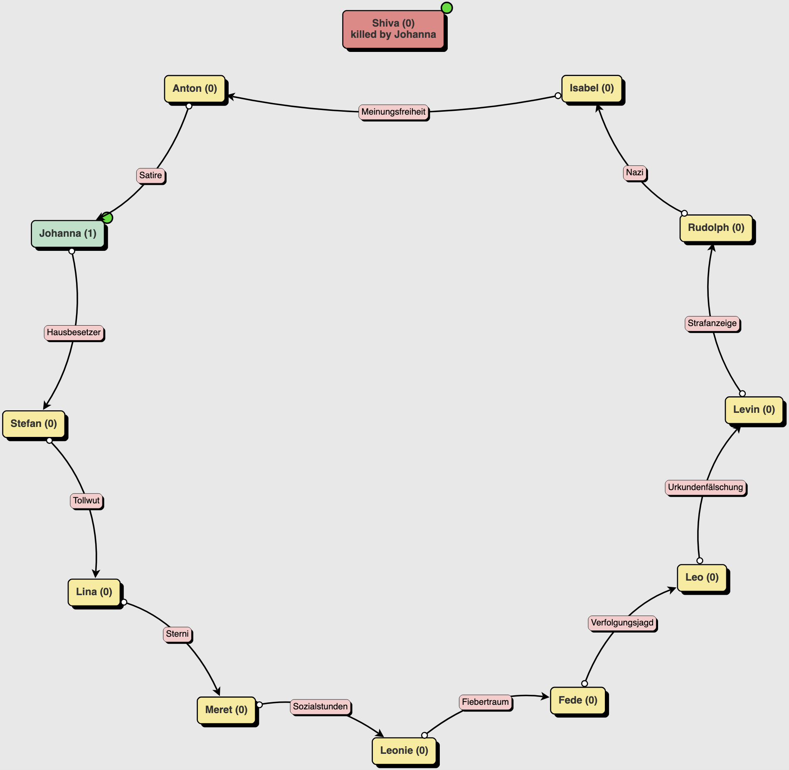

### GameMaster Protokoll
Die Auswertung ist am Ende natürlich auch sehr interessant, deshalb gibt es das Spielprotokoll für den GameMaster.
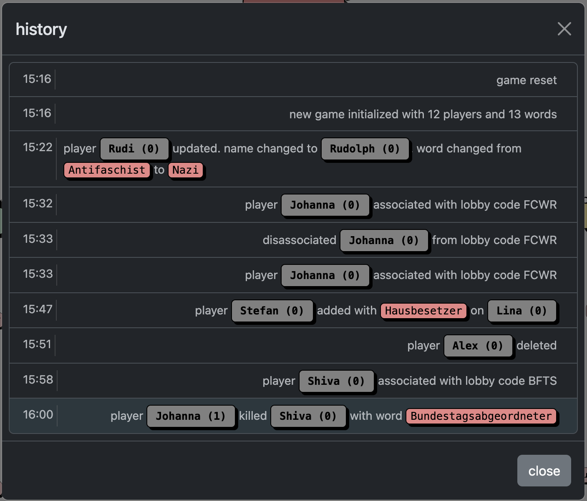