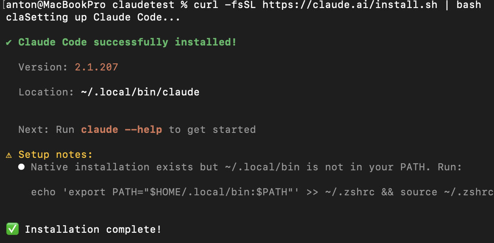
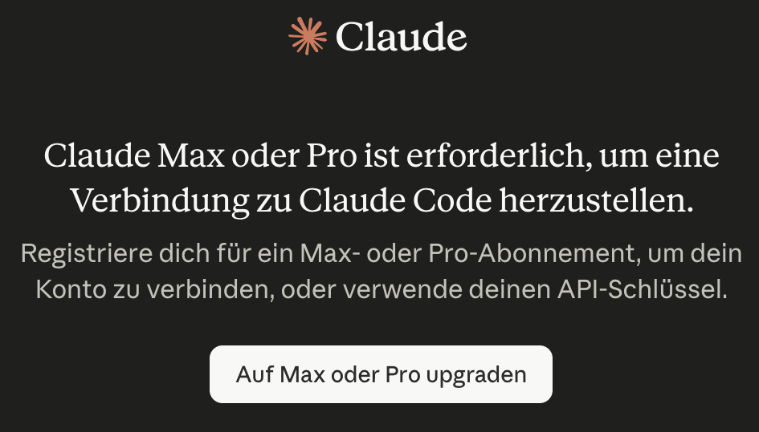
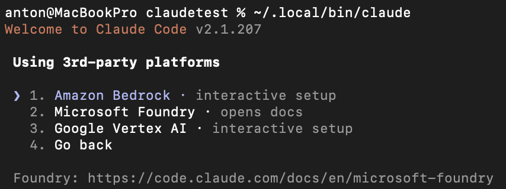

# Probleme mit claude
Ich konnte claude zwar installieren, musste aber feststellen, dass es keine kostenlose Testversion gibt, um Claude im CLI-Modus zu testen.

Es gab auch die Möglichkeit 3rd-party  Plattformen zu nutzen. Ich musste aber auch hier feststellen, dass mindestens eine Zahlungsmethode hinterlegt werden musste, bevor man seine free credits claimen konnte.

Dementsprechend habe ich entschieden, die Verwendung von Claude Code nicht weiter zu verfolgen, da ich ohnehin geplant hatte, das Semesterprojekt selbstständig zu programmieren.

